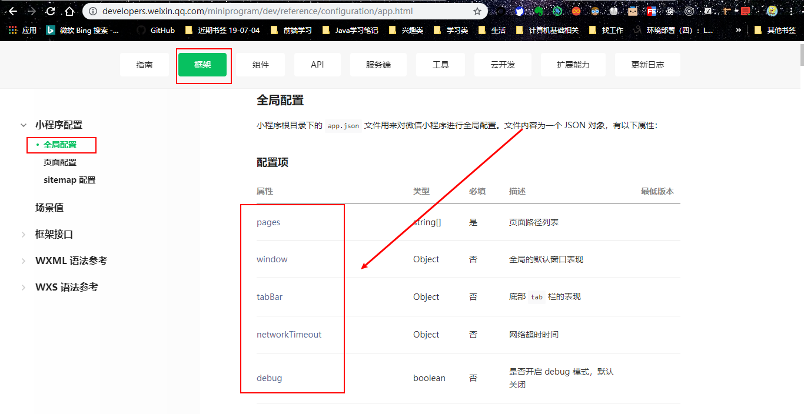
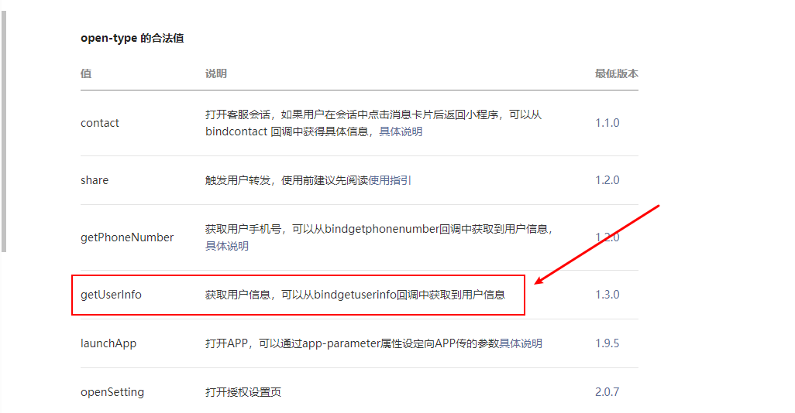

# 小程序开发学习

## 公共组件

所在位置：框架——小程序配置——全局配置，相关配置项如下：

- pages
- window
- tabBar




## 开发调试

在调试器中，点击 `Wxml` 即可查看网页结构


## 数据绑定


## 事件模型

> [事件模型](https://developers.weixin.qq.com/miniprogram/dev/framework/view/wxml/event.html)

分为 2 种，冒泡事件和非冒泡事件

- 冒泡事件：`bindtab`
- 非冒泡事件：`catchtab` ，推荐使用这个

```js
// 冒泡事件 
<view class='goStudy' bindtap='handleParent'>
    <text bindtap='handleChild'>我的小程序</text>
  </view>

// 非冒泡事件
 <view class='goStudy' catcchtap='handleParent'>
    <text catchtap='handleChild'>我的小程序</text>
  </view>
```


## 页面生命周期

> [页面生命周期](https://developers.weixin.qq.com/miniprogram/dev/framework/app-service/page-life-cycle.html)

理解2个概念：

- 进程：理解为 chrome 程序，可以多开，每个互不影响；
- 线程：理解为 chrome 的多个 tab 页，每个tab 页都是依赖同一个进程；

理解 Page的 3 个生命周期函数：

- `onLoad` 页面加载完成，通常做如下工作：**只调用一次**
  - 初始化
  - 发送请求
  - 开启定时器
- `onShow` 页面显示完成，每次数据变更都会渲染，所以调用很多次。
- `onReady` 页面初次渲染完成
- `onUnload` 页面卸载，组件销毁前

## 遇到报错

我们使用微信的 api 获取头像和昵称信息，代码如下：

```js
 data: {
    message: "小林子呀~"
  },  

onLoad: function (options) {
    // 获取用户登录信息
    wx.getUserInfo({
      success (data) {
        console.log(data);
        this.setData({
          message: data.userInfo.nickName,
        })
      },
    })
  },
```

但是出现如下报错：

```js
this.setData is not a function;at pages/index/index onLoad function;at api operateWXData success callback function
TypeError: this.setData is not a function
    at Function.success (http://127.0.0.1:49699/appservice/pages/index/index.js:28:14)
```

原因： this 问题，因为 `onLoad` 是个回调函数，回调的 this 不再是当前 page 对象，而是 wx，此时 this 指向改变。

解决： 使用箭头函数

```js
onLoad: function (options) {
    // 获取用户登录信息
    wx.getUserInfo({
      success: (data)=> {
        console.log(data);
        this.setData({
          message: data.userInfo.nickName,
        })
      },
    })
  },

```

获取导数据后，我们可以在页面使用动态填充数据：


## 用户授权

以上，我们通过 `getUserInfo`  是因为我们已授权才可以获取用户信息，但是，当用户使用时，是需要经过同意才可以获取的，授权方式如下：

- [open-type](https://developers.weixin.qq.com/miniprogram/dev/component/button.html) 微信开放能力



我们可以写一个简单的 demo 测试其是否可以使用：

在此之前，我们需要清除授权数据：


接着，我们来看代码：

```js
<view class="indexContainer">
  <image class='avatar' src='{{userInfo.avatarUrl}}'></image>
  <text class='userName'>hello, {{userInfo.nickName}}</text>

  <button open-type='getUserInfo'>用户授权</button>

  <view class='goStudy' catchtap='handleParent'>
    <text catchtap='handleChild'>我的小程序</text>
  </view>
</view>
```

点击效果如下：


注意：当没有使用 appId 打开项目时，无法清除授权信息；

用户 允许以后，**刷新** 页面后即可看到用户头像和昵称。

但是有几个问题：

- 每次用户授权以后都要手动刷新页面才可以看到用户头像和数据？
- 对于已授权的用户，还要提示进行授权吗？

使用微信的 **获取设置** API 来获得授权信息

```js
wx.getSetting({
    success: (data) => {
        console.log(data);
    }
}) 

```


接下来，我们可以来判断是否已授权：

```js
wx.getSetting({
    success: (data) => {
        if(data.authSetting.scope.userInfo) {
            // 用户已授权
        }else{
            // 用户未授权
        }
    }
})
```

这里，**很容易犯一个致命错误**—— `data.authSetting.scope.userInfo` ，这个写法是错误的，因为返回的 `authSetting` 数据格式不规范， `scope` 并不是一个对象，因此，不能使用 `xxx.scope.userInfo` 来获取该属性值。

我们应该这么写：

```js
wx.getSetting({
    success: (data) => {
        if(data.authSetting['scope.userInfo']) {
            // 用户已授权
        }else{
            // 用户未授权
        }
    }
})
```

此时，我们对于 button 提示用户授权我们需要进行判断

```js
// index.js
Page({
    data: {
        isShow: true;
    },
    onLoad: function() {
        wx.getSetting({
        success: (data) => {
            if(data.authSetting['scope.userInfo']) {
                // 用户已授权
                this.setData({
                    isShow: false
                })
            }else{
                // 用户未授权
                 this.setData({
                    isShow: true
                })
            }
        }
    })
    }
})

// index.wxml
<button style="display: {{isShow ? 'block' : 'none'}}" open-type='getUserInfo'>用户授权</button>
```

用户已授权以后，我们需要手动编译后刷新页面才可以看到授权后用户信息，这不符合我们的需求，我们想：

用户授权后，自动获取用户信息并展现：

怎么办？使用回调函数 `bindgetuserinfo` ，使用如下：

```js
// index.wxml
<button style="display: {{isShow ? 'block' : 'none'}}" open-type='getUserInfo' bindgetuserinfo="handleGetUserInfo">用户授权</button>

// index.js
 handleGetUserInfo(data) {
    console.log('用户授权后回调', data);
  },
```

如何判断是否已授权？


代码如下：

```js
handleGetUserInfo(data) {
    console.log('用户授权后回调', data);
    if(data.detail.rowData) {
        // 表示用户已授权
        this.getUserInfo();
    } else {
        // 用户未授权
    }
  },
```

考虑到 onLoad 只能使用一次，我们对代码进行优化：

```js
// pages/index/index.js
Page({

  /**
   * 页面的初始数据
   */
  data: {
    message: "小林子呀~",
    userInfo: null,
  },
  handleParent() {
    console.log("父元素");
  },
  handleChild() {
    console.log("子元素");
  },
  // 用户授权回调
  handleGetUserInfo(data) {
    console.log('用户授权后回调', data);
    if(data.detail.rowData) {
      this.getUserInfo();
    }
  },
  // 获取用户信息
  getUserInfo() {
    wx.getUserInfo({
      success: (data) => {
        console.log(data);
        this.setData({
          message: data.userInfo.nickName,
          userInfo: data.userInfo
        })
      },
      fail: () => {
        console.log('fail');
      }
    })
  },
  // 获取用户是否已授权
  getUserSetting() {
    wx.getSetting({
      success: (data) => {
        console.log('授权信息', data);
      }
    })
  },
  /**
   * 生命周期函数--监听页面加载
   */
  onLoad: function (options) {
    // 获取用户登录信息
    this.getUserInfo();
    this.getUserSetting();
  },
})
```


## Swiper组件

### 导航

> [wx.navigateTo(Object object)](https://developers.weixin.qq.com/miniprogram/dev/api/route/wx.navigateTo.html)
>
> [wx.redirectTo(Object object)](https://developers.weixin.qq.com/miniprogram/dev/api/route/wx.redirectTo.html)

- `wx.navgateTo`   保留当前页面，跳转到应用内的某个页面。
- `wx.redirectTo` 关闭当前页面，跳转到应用内的某个页面。

相关代码：

```js
//  
<view class='goStudy' catchtap='handleClick'>
    <text catchtap='handleChild'>我的小程序</text>
</view>

// index.js
handleClick() {
    wx.navigateTo({
      url: '/pages/list/list',
    })
  },
```

Swiper 组件的使用：

> [swiper](https://developers.weixin.qq.com/miniprogram/dev/component/swiper.html)

- `Swiper` 滑块视图容器。
- `Swiper-item`
- `indicator-dots`  是否显示面板指示点
- `indicator-color` 指示点颜色
- `indicator-active-color`  当前选中的指示点颜色

```js
<view>
  <swiper indicator-dots="true" indicator-color="white" indicator-active-color="green">
    <swiper-item>
      <image src='/images/list/g-01.jpg'></image>
    </swiper-item>
    <swiper-item>
      <image src='/images/list/g-02.jpg'></image>
    </swiper-item>
  </swiper>
</view>
```


## Template 模板的基本使用

> 写在前面：使用 Webstorm 开发小程序，其无法识别 `.wxml` 和 `.wxss` 文件，需要配置，让 webstorm 识别该文件为 `HTML` 文件和 `CSS` 文件，方法： Webstorm --> File --> Settings --> Editor --> File Types，找到对应的 HTML 和 CSS ，添加上面这两种后缀的文件

- [Template](https://developers.weixin.qq.com/miniprogram/dev/reference/wxml/template.html) 模板
  - 使用 name 属性，作为模板的名字
  - 使用 is 属性，声明需要的使用的模板
- 模板的引用 和 css 样式的引用

```js
// list.wxml 文件中引入 template 模板
<import src="/pages/template/list-template.wxml" />
    
// list.wxss 文件中引入 template 的样式
@import "/pages/template/list-template.wxss";
```


## 列表渲染

### 使用相对路径 require

```js
// list.js
// 错误形式
let datas = require("/datas/list-data.js");
console.log(datas);

// 正确形式
let datas = require("../../datas/list-data.js");
console.log(datas);
```

在开发中，如果使用绝对路径 `require` 外部文件，是无效的，需要使用 **相对路径**

### 列表渲染

[Block](https://developers.weixin.qq.com/miniprogram/dev/reference/wxml/template.html)

- `block` 
- `wx:for='{{array}}'` 数据遍历
- `wx:key='{{index}}'` 默认使用 index 表示数组的下标
- `data='{{...item}}'` 默认使用 item 表示数组的每一项

代码：

```js
// list.js 
let datas = require("../../datas/list-data.js");
Page({
    data: {
        listArr: [],
    },
})

// list.wxml
<block wx:for="{{listArr}}" wx:key="{{index}}">
    <view>
      <template is="listTem" data='{{...item}}'/>
    </view>
  </block>
```


## Detai详情页搭建

### 静态页面

主要内容为 HTML 和 CSS

```js
<!--pages/detail/detail.wxml-->
<view class="detaiContainer">
  <image src="/images/detail/carousel/01.jpg" class="headImg"></image>
  <view class="avatar_date">
    <image src="/images/avatar/1.png"></image>
    <text>美国队长</text>
    <text>发布于</text>
    <text>Dec 1st 2019</text>
  </view>
  <text class="company">详情页测试</text>
  <view class="collection_share_container">
    <view class="collection_share">
      <image src="/images/icon/collection-anti.png"></image>
      <image src="/images/icon/share.png"></image>
    </view>
    <view class="line"></view>
  </view>
   <button>转发此文章</button>
   <text class="content">详情页测试详情页测试详情页测试详情页测试详情页测试详情页测试</text>
</view>
```


### 路由跳转

list.wxml 文件中，事件使用：

- `catchtap="toDetail"` ，
- `data-xxx="{{yyy}}"` 使用 `data-` 的形式传值

```js
 <block wx:for="{{listArr}}" wx:key="{{index}}">
    <view catchtap="toDetail" data-index="{{index}}">
      <template is="listTem" data='{{...item}}'/>
    </view>
  </block>
```

对应的 list.js 文件中，需要获取事件，拿到传入的参数

```js
  // 点击跳转到详情页
  toDetail(event) {
    console.log(event);
    let index = event.currentTarget.dataset.index;
    wx.navigateTo({
      url: '/pages/detail/detail?index=' + index,
    })
  },
```


跳转至 detail 页面后，通过 `options` 获取传入的值

```js
  /**
   * 生命周期函数--监听页面加载
   */
  onLoad: function (options) {
    console.log(options); // {index: "0"}
  },
```

设置值：

```js
// pages/detail/detail.js
let datas = require("../../datas/list-data.js");
Page({

  /**
   * 页面的初始数据
   */
  data: {
    detailObj: [],
    index: null,
  },

  /**
   * 生命周期函数--监听页面加载
   */
  onLoad: function (options) {
    let index = options.index;
    this.setData({
      detailObj: datas.list_data[index],
      index,
    });
  }
})
```

对应的 detail.wxml 页面使用 变量

```js
<view class="detaiContainer">
  <image src="{{detailObj.detail_img}}" class="headImg"></image>
  <view class="avatar_date">
    <image src="{{detailObj.avatar}}"></image>
    <text>{{detailObj.author}}</text>
    <text>发布于</text>
    <text>{{detailObj.date}}</text>
  </view>
  <text class="company">{{detailObj.title}}</text>
  <view class="collection_share_container">
    <view class="collection_share">
      <image src="/images/icon/collection-anti.png"></image>
      <image src="/images/icon/share.png"></image>
    </view>
    <view class="line"></view>
  </view>
   <button>转发此文章</button>
   <text class="content">{{detailObj.detail_content}}</text>
</view>
```

此时，我们刷新页面即可看到效果，在控制台找到 `Wxml` 即可查看结构

## currentTarget 和 target 的区别和使用

### 事件委托和target 的使用

场景：点击不同的轮播图，跳转到不同的页面

轮播图结构：

```js
<swiper indicator-dots="true" indicator-color="white" indicator-active-color="green">
    <swiper-item>
      <image src='/images/list/g-01.jpg'></image>
    </swiper-item>
    <swiper-item>
      <image src='/images/list/g-02.jpg'></image>
    </swiper-item>
    <swiper-item>
      <image src='/images/list/g-03.jpg'></image>
    </swiper-item>
    <swiper-item>
      <image src='/images/list/g-04.jpg'></image>
    </swiper-item>
  </swiper>
```

bad 做法：每个 `swiper-item` 添加点击事件

good 做法：

- **使用事件委托** ，给 `swiper` 添加 `catchTab` 事件
- 给 img 添加 `data-index` 

```js
// list.wxml
<import src="/pages/template/list-template.wxml" />
<view>
  <swiper catchtap="carouselToDetail" indicator-dots="true" indicator-color="white" indicator-active-color="green">
    <swiper-item>
      <image data-index="0" src='/images/list/g-01.jpg'></image>
    </swiper-item>
    <swiper-item>
      <image data-index="1" src='/images/list/g-02.jpg'></image>
    </swiper-item>
    <swiper-item>
      <image data-index="2" src='/images/list/g-03.jpg'></image>
    </swiper-item>
    <swiper-item>
      <image data-index="3" src='/images/list/g-04.jpg'></image>
    </swiper-item>
  </swiper>
  <block wx:for="{{listArr}}" wx:key="{{index}}">
    <view catchtap="toDetail" data-index="{{index}}">
      <template is="listTem" data='{{...item}}'/>
    </view>
  </block>
</view>

// list.js

// 点击轮播图跳转
carouselToDetail(e) {
    console.log(e);
},
```

此时，我们需要从 `e.target` 中获取值，而不是前面我们点击图片跳转时从 `e.currentTarget`  中跳转


那么，问题来了：

### `target` 和 `currentTarget` 的区别

我们看这两次事件使用的场景：

- currentTarget ：事件 和 data-index 在同一个元素上。**指向的是捕获事件的元素。**

```js
// list.wxml
<block wx:for="{{listArr}}" wx:key="{{index}}">
    <view catchtap="toDetail" data-index="{{index}}">
      <template is="listTem" data='{{...item}}'/>
    </view>
  </block>

// list.js
toDetail(event) {
    console.log(event);
    let index = event.currentTarget.dataset.index;
    wx.navigateTo({
      url: '/pages/detail/detail?index=' + index,
    })
  },
```

- target： 事件 和 data-index 在不同元素上，存在父子关系。**指向的是触发事件的元素。**

```js
// list.wxml
<swiper catchtap="carouselToDetail" indicator-dots="true" indicator-color="white" indicator-active-color="green">
    <swiper-item>
      <image data-index="0" src='/images/list/g-01.jpg'></image>
    </swiper-item>
</swiper>

// list.js
carouselToDetail(e) {
    console.log(e);
},
```

## 收藏功能

### 收藏和提示框

原理很简单：

- data 添加 showFlag
- 事件点击切换 showFlag
- 函数 setData

新增提示框，提示收藏成功或失败：

- [wx.showToast](https://developers.weixin.qq.com/miniprogram/dev/api/ui/interaction/wx.showToast.html#%E6%B3%A8%E6%84%8F)

```js
let title = isCollected? '收藏成功' : '取消收藏';
wx.showToast({
    title,
    icon: 'success'
})
```

### 本地存储

上面的收藏虽然实现，但是是存储在 data 中，当页面退出去以后再进来，就看不到收藏状态了，**因为页面刷新重新渲染，收藏状态被赋予初始值** 。

因此，我们需要对数据进行**本地存储**。同时，需要对每个页面的存储添加相关信息。

- [数据存储](https://developers.weixin.qq.com/miniprogram/dev/api/storage/wx.setStorage.html) 这是一个异步存储接口
- [数据读取](https://developers.weixin.qq.com/miniprogram/dev/api/storage/wx.getStorage.html) 这是一个异步读取接口

效果如图： 


`detail.js` 代码如下：

```js
  /**
   * 生命周期函数--监听页面加载
   */
  onLoad: function (options) {
    let index = options.index;
    this.setData({
      detailObj: datas.list_data[index],
      index,
    });

    // 根据本地缓存的数据判断是否收藏当前的文章
    let detailStorage = wx.getStorageSync("isCollected");
    console.log(detailStorage);

    // 在缓存中初始化 空对象
    if(!detailStorage){
      wx.setStorageSync('isCollected', {})
    }

    //判断用户 是否收藏
    if(detailStorage[index]){
      this.setData({
        isCollected: true
      })
    }
  },
```

收藏功能代码：

```js
handleCollection() {
    console.log('collect');
    let isCollected = !this.data.isCollected;
    this.setData({
      isCollected
    })
    let title = isCollected ? '收藏成功' : '取消收藏';
    wx.showToast({
      title,
      icon: 'success'
    })

    // 缓存数据到本地
    let { index } = this.data;
    let obj = wx.getStorage({
      key: 'isCollected',
      success: function(datas) {
        let obj = datas.data;
        obj[index] = isCollected;
        wx.setStorage({
          key: 'isCollected',
          data: obj,
          success: () => {
            console.log('缓存成功');
          }
        })
      },
    })
    // obj.index = isCollected; 注意，这里使用 obj.index 和 obj[index]区别，前者被识别为 字符串，后者为 变量
    //obj[index] = isCollected;
  },
```

需要注意个地方：`obj.index 和 obj[index]` 的区别

- `obj.index` 此处的 index 为对象中的 字符串，或者为 key 值
- `obj[index]` 此处的 index 为变量


## 音乐播放功能

> 这里的视频内容和微信开发文档内容有差异，需要查文档根据实际情况开发

- [微信背景音频API](https://developers.weixin.qq.com/miniprogram/dev/api/media/background-audio/wx.stopBackgroundAudio.html) 
- 具体使用 eg：

```js
const backgroundAudioManager = wx.getBackgroundAudioManager()

backgroundAudioManager.title = '此时此刻'
backgroundAudioManager.epname = '此时此刻'
backgroundAudioManager.singer = '许巍'
backgroundAudioManager.coverImgUrl = 'http://y.gtimg.cn/music/photo_new/T002R300x300M000003rsKF44GyaSk.jpg?max_age=2592000'
// 设置了 src 之后会自动播放
backgroundAudioManager.src = 'http://ws.stream.qqmusic.qq.com/M500001VfvsJ21xFqb.mp3?guid=ffffffff82def4af4b12b3cd9337d5e7&uin=346897220&vkey=6292F51E1E384E061FF02C31F716658E5C81F5594D561F2E88B854E81CAAB7806D5E4F103E55D33C16F3FAC506D1AB172DE8600B37E43FAD&fromtag=46'
```

- 点击播放和暂停的时候，更换背景图为 音乐专辑图

```js
<image src="{{isMusicPlay ? detailObj.music.coverImgUrl : detailObj.detail_img}}" class="headImg"></image>

<image catchtap="handleMusicPlay" class="musicImg" src="{{isMusicPlay ? '/images/music/music-start.png' : '/images/music/music-stop.png' }}"></image>
```

- 监视音乐的播放和暂停状态
  - [BackgroundAudioManager.onPlay](https://developers.weixin.qq.com/miniprogram/dev/api/media/background-audio/BackgroundAudioManager.onPlay.html) 监听音乐播放
  - [BackgroundAudioManager.onPause](https://developers.weixin.qq.com/miniprogram/dev/api/media/background-audio/BackgroundAudioManager.onPause.html) 监听音乐暂停

- 处理不同页面不同音乐避免重复播放和状态冲突问题：
  - 每个页面的音乐 显示状态 只控制当前页面的音乐

```js
//外层定义 data ，内层使用 getApp 获取该 App
App({
    data: {
      isPlay: false,
      pageIndex: null
    }
})
```

detail.js 文件

```js
// 省略部分代码
let appData = getApp();  


// 监听音乐是否在播放
  if(appData.data.isPlay && appData.data.pageIndex === index) {
    this.setData({
      isMusicPlay: true
    })
  }

    // 监听音乐播放状态
    backgroundAudioManager.onPlay(() => {
      this.setData({
        isMusicPlay: true
      })
      // 修改全局 app 中音乐的播放状态
      appData.data.isPlay = true;
      appData.data.pageIndex = index;
    });
    
    
    // 监听音乐是否暂停
    backgroundAudioManager.onPause(() => {
      this.setData({
        isMusicPlay: false
      })
      appData.data.isPlay = false;
    })
   
```


- 无法播放音乐，报错提示：

解决办法：[requiredBackgroundModes](https://developers.weixin.qq.com/miniprogram/dev/reference/configuration/app.html#requiredBackgroundModes) 

```json
// 需要在最外层 app.json 中配置如下
"requiredBackgroundModes": ["audio", "location"]
```

>  [原因](https://developers.weixin.qq.com/miniprogram/dev/api/media/background-audio/wx.getBackgroundAudioManager.html)：从微信客户端6.7.2版本开始，若需要在小程序切后台后继续播放音频，需要在 [app.json](https://developers.weixin.qq.com/miniprogram/dev/reference/configuration/app.html) 中配置 `requiredBackgroundModes` 属性。开发版和体验版上可以直接生效，正式版还需通过审核。

